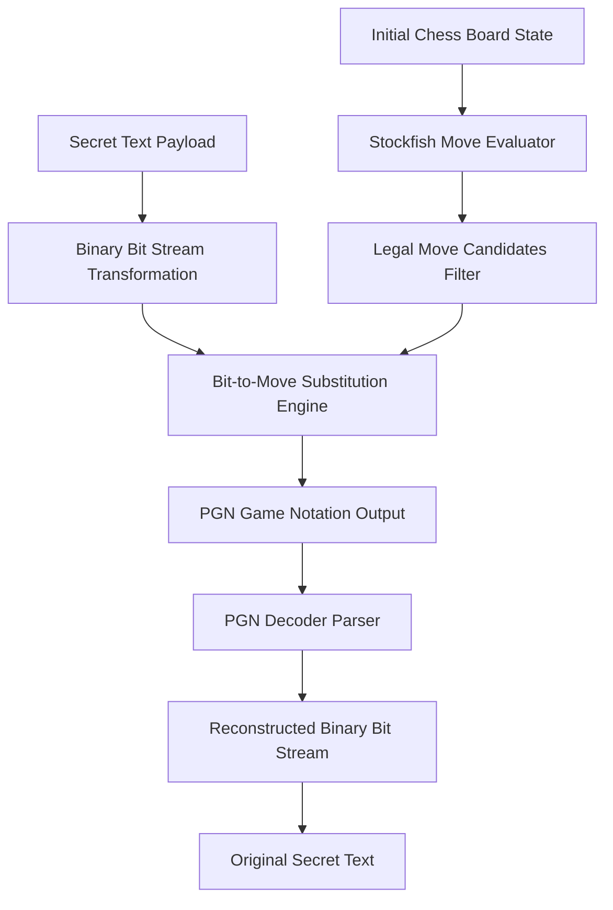

# ♟️ Chess Steganography: Tactical Covert Communication Protocol

[](https://python.org)
[](https://stockfishchess.org)
[](https://python-chess.readthedocs.io)
[](LICENSE)

**Chess Steganography** is a cryptographically secure, ambiguity-free covert communication protocol that translates secret binary text messages into standard, playable chess games saved as Portable Game Notation (PGN) files. The generated games are indistinguishable from natural chess play analyzed by the **Stockfish** grandmaster-level chess engine.

---

## 🌟 Key Features

* **Ambiguity-Free Bit Mapping Protocol**: Maps candidate legal moves to binary bit sequences. Forced or unique legal moves consume 0 bits to maintain bit-alignment integrity during decoding.
* **Stockfish Engine Optimization**: Filters candidate move pools to top-N evaluation moves according to Stockfish centipawn scoring, producing human-like, grandmaster-level game lines.
* **Symmetric Encoder / Decoder**: Complete bit-perfect reconstruction of raw secret text from standard PGN game notation files.
* **Infinite Stream Encoding**: Automatically chains multiple games or long game strings when secret message payloads exceed single-game bit capacities.

---

## 🏗️ Protocol Architecture



---

## 🛠️ Technology Stack

* **Language**: Python 3.9+
* **Chess Library**: `python-chess`
* **Analysis Engine**: Stockfish Chess Engine (UCI Protocol)
* **Format**: Portable Game Notation (PGN)

---

## 🚀 Quick Start Guide

### Prerequisites
* Python 3.9 or higher
* Stockfish engine executable installed on PATH

### Installation & Execution
```bash
# Clone repository
git clone https://github.com/dewernodecimal/ChessEncryption.git
cd ChessEncryption

# Install dependencies
pip install python-chess

# Encode a secret message into a PGN game
python encode.py --message "Meet at midnight" --output game.pgn

# Decode a secret message from a PGN game
python decode.py --input game.pgn
```

---

## 📄 License
Distributed under the MIT License. See `LICENSE` for details.